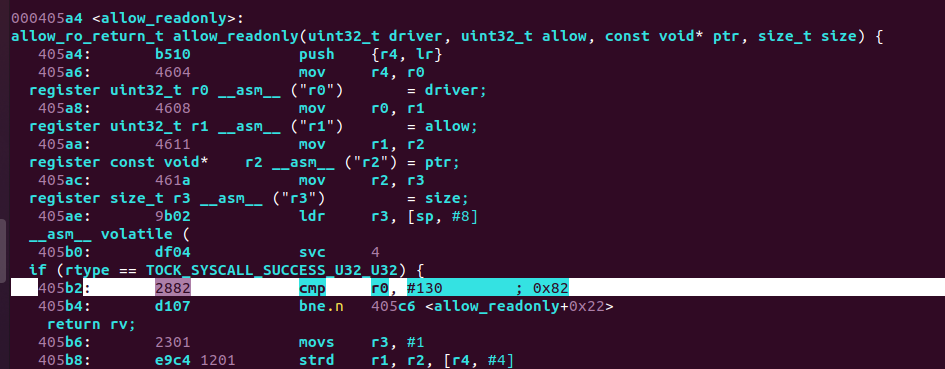
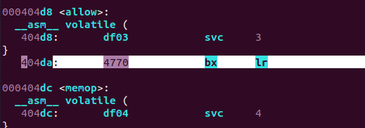
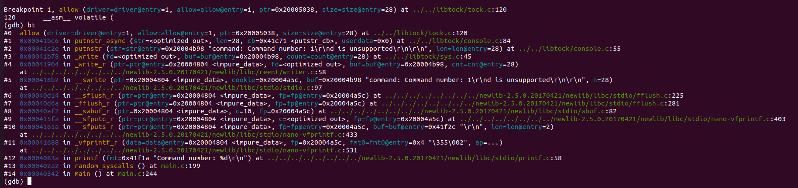
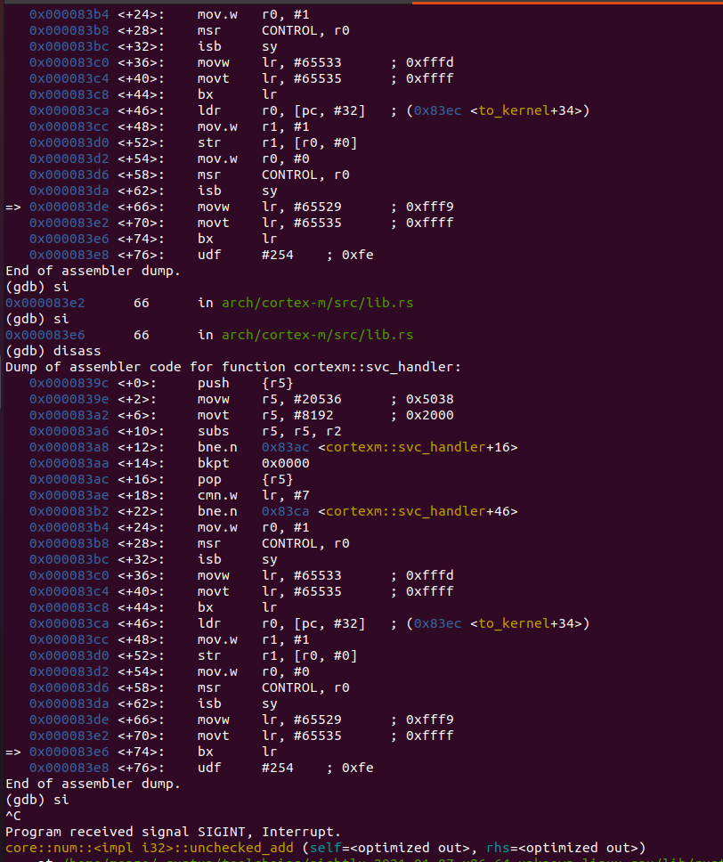

Update
==========

I have enabled the debug logging and I have cleared the code to the minimum versions that cause the bug, as suggested.

**Tock 2.0**

All versions tried (no systemcalls, only command systemcalls, only subscribe systemcalls) crash the application when executing the **svc 4** systemcall. This crash appears every time after a few seconds, in the **allow_readonly** function, called from **putnstr_async** which is called from **printf**. It seems that is caused by printf.



The folder Tock_v2.0 contains the outputs: the serial debug console, the disassembly and the c program that caused the crash.

Tock_v2.0/output1 has no systemcalls, just printfs.

Tock_v2.0/output2 has command systemcalls & printfs.

Tock_v2.0/output3 has subscribe systemcalls & printfs.


**Old Tock 1.6**

In this case, all the versions tried (no systemcalls, only command systemcalls, only subscribe systemcalls) crash the application when executing the **svc 3** systemcall. All the crashes appear in the **allow** function, called from the **putnstr_async** which is called from **printf**. It also seems to be caused by printf.

However the program with command systemcalls and printfs causes the crash every time and after a few seconds. The others (no systemcalls, only subscribe systemcalls) cause it after a few tens of minutes and not every time (I had to reset the board from time to time).



The folder Tock_v1.6 contains the outputs: the serial debug console, the disassembly and the c program that caused the crash.

Tock_v1.6/output1 has command systemcalls & printfs.

Tock_v1.6/output2 has no systemcalls, just printfs.

Tock_v1.6/output3 also has no systemcalls, just printfs.


Dumb Fuzzer
==========

This is a sample program highlighting an issue I
discovered while working with Tock. It manifests as a crash on the application side but upon further investigation it seemed to crash in kernel space on a ***bx lr*** (this is from Tock v1.6, for more details see ***Context*** section below). The tock v 2.0 crashes on the application side on a cmp instruction.

This application is a very simple fuzzer that tries a few Tock OS system calls (allow_readwrite, subscribe, command) with random / uninitialised values as parameters and logs the fuzzing process on the console.

To get a more context on this issue and how I got here, please read ***Context*** section below.

This application is tested and developed for the Microbit V2 board.
It uses the latest version of TockOS kernel (the version on master branch) flashed without bootloader (**tock/boards/microbit_v2/layout.ld**). The libtock-c version is also the latest (from master branch).

Steps:

After flashing the kernel, go to the corresponding dumb_fuzzer application folder: **libtock-c/examples/dumb_fuzzer** and run **make**.

Load the application onto the board with tockloader:
```
tockloader install --board microbit_v2 --openocd ./build/dumb_fuzzer.tab
```

Open the serial to see the logging:
```
tockloader listen
```

After a few logging lines, the application will crash with a similar output as the one below:

```
panicked at 'Process dumb_fuzzer had a fault', kernel/src/process_standard.rs:287:17
	Kernel version release-1.6-1488-gbf54e789c

---| No debug queue found. You can set it with the DebugQueue component.

---| Cortex-M Fault Status |---
Data Access Violation:              true
Forced Hard Fault:                  true
Faulting Memory Address:            0x00000000
Fault Status Register (CFSR):       0x00000082
Hard Fault Status Register (HFSR):  0x40000000

---| App Status |---
𝐀𝐩𝐩: dumb_fuzzer   -   [Faulted]
 Events Queued: 0   Syscall Count: 314   Dropped Upcall Count: 0
 Restart Count: 0
 Last Syscall: Some(Memop { operand: 1, arg0: 108 })


 ╔═══════════╤══════════════════════════════════════════╗
 ║  Address  │ Region Name    Used | Allocated (bytes)  ║
 ╚0x20006000═╪══════════════════════════════════════════╝
             │ ▼ Grant        1280 |   1280          
  0x20005B00 ┼───────────────────────────────────────────
             │ Unused
  0x200057D0 ┼───────────────────────────────────────────
             │ ▲ Heap         3300 |   4116               S
  0x20004AEC ┼─────────────────────────────────────────── R
             │ Data            748 |    748               A
  0x20004800 ┼─────────────────────────────────────────── M
             │ ▼ Stack        2048 |   2048          
  0x20004000 ┼───────────────────────────────────────────
             │ Unused
  0x20004000 ┴───────────────────────────────────────────
             .....
  0x00044000 ┬─────────────────────────────────────────── F
             │ App Flash     16336                        L
  0x00040030 ┼─────────────────────────────────────────── A
             │ Protected        48                        S
  0x00040000 ┴─────────────────────────────────────────── H

  R0 : 0x00000001    R6 : 0x00000000
  R1 : 0x00000001    R7 : 0x20005140
  R2 : 0x20005140    R8 : 0x20004AE4
  R3 : 0x0000001E    R10: 0x00000002
  R4 : 0x20004588    R11: 0x00000000
  R5 : 0x00042135    R12: 0x0D9E67A2
  R9 : 0x20004800 (Static Base Register)
  SP : 0x20004558 (Process Stack Pointer)
  LR : 0x00042055
  PC : 0x0004069A
 YPC : 0x00040700

 APSR: N 0 Z 0 C 1 V 0 Q 0
       GE 0 0 0 0
 EPSR: ICI.IT 0x00
       ThumbBit true 

 Total number of grant regions defined: 14
  Grant  0: --          Grant  5: --          Grant 10: --        
  Grant  1: --          Grant  6: --          Grant 11: --        
  Grant  2: 0x20005fd0  Grant  7: 0x20005fe4  Grant 12: --        
  Grant  3: --          Grant  8: --          Grant 13: --        
  Grant  4: 0x20005fd8  Grant  9: 0x20005fec

 Cortex-M MPU
  Region 0: [0x20004000:0x20006000], length: 8192 bytes; ReadWrite (0x3)
    Sub-region 0: [0x20004000:0x20004400], Enabled
    Sub-region 1: [0x20004400:0x20004800], Enabled
    Sub-region 2: [0x20004800:0x20004C00], Enabled
    Sub-region 3: [0x20004C00:0x20005000], Enabled
    Sub-region 4: [0x20005000:0x20005400], Enabled
    Sub-region 5: [0x20005400:0x20005800], Enabled
    Sub-region 6: [0x20005800:0x20005C00], Disabled
    Sub-region 7: [0x20005C00:0x20006000], Disabled
  Region 1: [0x00040000:0x00044000], length: 16384 bytes; UnprivilegedReadOnly (0x2)
    Sub-region 0: [0x00040000:0x00040800], Enabled
    Sub-region 1: [0x00040800:0x00041000], Enabled
    Sub-region 2: [0x00041000:0x00041800], Enabled
    Sub-region 3: [0x00041800:0x00042000], Enabled
    Sub-region 4: [0x00042000:0x00042800], Enabled
    Sub-region 5: [0x00042800:0x00043000], Enabled
    Sub-region 6: [0x00043000:0x00043800], Enabled
    Sub-region 7: [0x00043800:0x00044000], Enabled
  Region 2: Unused
  Region 3: Unused
  Region 4: Unused
  Region 5: Unused
  Region 6: Unused
  Region 7: Unused

To debug, run `make debug RAM_START=0x20004000 FLASH_INIT=0x40059`
in the app's folder and open the .lst file.
```

When inspecting the .lst file, we can see that the program had a fault in **allow_readonly** function, at the driver number cmp instruction (address 4069a can be seen in PC register):

```
0004068c <allow_readonly>:
allow_ro_return_t allow_readonly(uint32_t driver, uint32_t allow, const void* ptr, size_t size) {
   4068c:       b510            push    {r4, lr}
   4068e:       4604            mov     r4, r0
  register uint32_t r0 __asm__ ("r0")       = driver;
   40690:       4608            mov     r0, r1
  register uint32_t r1 __asm__ ("r1")       = allow;
   40692:       4611            mov     r1, r2
  register const void*    r2 __asm__ ("r2") = ptr;
   40694:       461a            mov     r2, r3
  register size_t r3 __asm__ ("r3")         = size;
   40696:       9b02            ldr     r3, [sp, #8]
  __asm__ volatile (
   40698:       df04            svc     4
  if (rtype == TOCK_SYSCALL_SUCCESS_U32_U32) {
   4069a:       2882            cmp     r0, #130        ; 0x82
   4069c:       d107            bne.n   406ae <allow_readonly+0x22>
    return rv;
   4069e:       2301            movs    r3, #1
   406a0:       e9c4 1201       strd    r1, r2, [r4, #4]
   406a4:       7023            strb    r3, [r4, #0]
   406a6:       2300            movs    r3, #0
   406a8:       7323            strb    r3, [r4, #12]
}
```

I haven't found out the cause of this issue yet. Am I using the TockOS and libtock-c correctly? Do you have any idea what is the cause? Any suggestion on how to investigate it further?


Context
==========


I started this fuzzing project intially on a 1.6 TockOS version. I haven't used the release-1.6 version from the repository's tags since it didn't yet had support for the board I'm using (microbit V2). 

More specifically, I used the following tock-os and libtock-c versions:

tock:
commit f01a807e206f74828140be7e4d99df012467aaa3 


libtock-c:
commit cd3100f82ddb62e92706976f089b29fd64a0aeb4 

The code I started with is similar with this one but with a simple allow system call (see main_v1.6.c file).

On the application side I get a similar fault:

```
panicked at 'Process dumb_fuzzer had a fault', kernel/src/process.rs:990:17
	Kernel version release-1.6-723-gcf5819e98

---| No debug queue found. You can set it with the DebugQueue component.

---| Fault Status |---
Data Access Violation:              true
Forced Hard Fault:                  true
Faulting Memory Address:            0x00000000
Fault Status Register (CFSR):       0x00000082
Hard Fault Status Register (HFSR):  0x40000000

---| App Status |---
App: dumb_fuzzer   -   [Fault]
 Events Queued: 0   Syscall Count: 1900   Dropped Callback Count: 0
 Restart Count: 0
 Last Syscall: Some(MEMOP { operand: 1, arg0: 108 })


 ╔═══════════╤══════════════════════════════════════════╗
 ║  Address  │ Region Name    Used | Allocated (bytes)  ║
 ╚0x20006000═╪══════════════════════════════════════════╝
             │ ▼ Grant        1296 |   1296          
  0x20005AF0 ┼───────────────────────────────────────────
             │ Unused
  0x2000579C ┼───────────────────────────────────────────
             │ ▲ Heap         3516 |   4368               S
  0x200049E0 ┼─────────────────────────────────────────── R
             │ Data            480 |    480               A
  0x20004800 ┼─────────────────────────────────────────── M
             │ ▼ Stack         656 |   2048          
  0x20004570 ┼───────────────────────────────────────────
             │ Unused
  0x20004000 ┴───────────────────────────────────────────
             .....
  0x00044000 ┬─────────────────────────────────────────── F
             │ App Flash     16256                        L
  0x00040080 ┼─────────────────────────────────────────── A
             │ Protected       128                        S
  0x00040000 ┴─────────────────────────────────────────── H

  R0 : 0x00000001    R6 : 0x00000000
  R1 : 0x00000001    R7 : 0x20005038
  R2 : 0x20005038    R8 : 0x200049D8
  R3 : 0x0000001C    R10: 0x00041F10
  R4 : 0x0000001C    R11: 0x00000001
  R5 : 0x00041C71    R12: 0x00000000
  R9 : 0x00041EBE (Static Base Register)
  SP : 0x200045F0 (Process Stack Pointer)
  LR : 0x00041BC7
  PC : 0x000405BC
 YPC : 0x000405C2

 APSR: N 0 Z 0 C 1 V 0 Q 0
       GE 0 0 0 0
 EPSR: ICI.IT 0x00
       ThumbBit true 

 Cortex-M MPU
  Region 0: [0x20004000:0x20006000], length: 8192 bytes; ReadWrite (0x3)
    Sub-region 0: [0x20004000:0x20004400], Enabled
    Sub-region 1: [0x20004400:0x20004800], Enabled
    Sub-region 2: [0x20004800:0x20004C00], Enabled
    Sub-region 3: [0x20004C00:0x20005000], Enabled
    Sub-region 4: [0x20005000:0x20005400], Enabled
    Sub-region 5: [0x20005400:0x20005800], Enabled
    Sub-region 6: [0x20005800:0x20005C00], Disabled
    Sub-region 7: [0x20005C00:0x20006000], Disabled
  Region 1: [0x00040000:0x00044000], length: 16384 bytes; UnprivilegedReadOnly (0x2)
    Sub-region 0: [0x00040000:0x00040800], Enabled
    Sub-region 1: [0x00040800:0x00041000], Enabled
    Sub-region 2: [0x00041000:0x00041800], Enabled
    Sub-region 3: [0x00041800:0x00042000], Enabled
    Sub-region 4: [0x00042000:0x00042800], Enabled
    Sub-region 5: [0x00042800:0x00043000], Enabled
    Sub-region 6: [0x00043000:0x00043800], Enabled
    Sub-region 7: [0x00043800:0x00044000], Enabled
  Region 2: Unused
  Region 3: Unused
  Region 4: Unused
  Region 5: Unused
  Region 6: Unused
  Region 7: Unused

To debug, run `make lst` in the app's folder
and open the arch.0x40080.0x20004000.lst file.
```

It looks like the fault is on the application side with a Faulting Memory Address of 0x00.

If we look at the registers (especially the PC) and look into the **arch.0x40080.0x20004000.lst file** we observe that the fault is in the allow systemcall maybe in the svc handler.

```
000405bc <allow>:
  __asm__ volatile (
   405bc:       df03            svc     3
}
   405be:       4770            bx      lr
```

From the LR register we can also deduce that the allow syscall was called from **putnstr_async** function.

I have successfully managed to re-compile my application in order to run at a fixed address and then used gdb-multiarch. I managed to get the backtrace when this fault happens.



I seems that something strange happens inside the svc handler ***only at this combination of parameters passed to the allow syscall***

I have also tried debugging from the kernel side.

The following assembly code was added in the ***arch/cortex-m/src/lib.rs*** file, inside the **svc_handler** to help catch the fault:
```
 /// This is called after a `svc` instruction, both when switching to userspace
/// and when userspace makes a system call.
#[cfg(all(target_arch = "arm", target_os = "none"))]
#[naked]
pub unsafe extern "C" fn svc_handler() {
    asm!(
        "
    // First check to see which direction we are going in. If the link register
    // is something other than 0xfffffff9, then we are coming from an app which
    // has called a syscall.

    push {{r5}}
    movw r5, #0x5038
    movt r5, #0x2000
    subs r5, r5, r2
    bne next
    bkpt
    next:
    pop {{r5}}
...
```
It basically stops if the R2 is equal to the problematic memory address 0x20005038.

I ran gdb-multiarch on this code and if faulted when returning from the svc_handler, on the last ***bx lr*** instruction.

